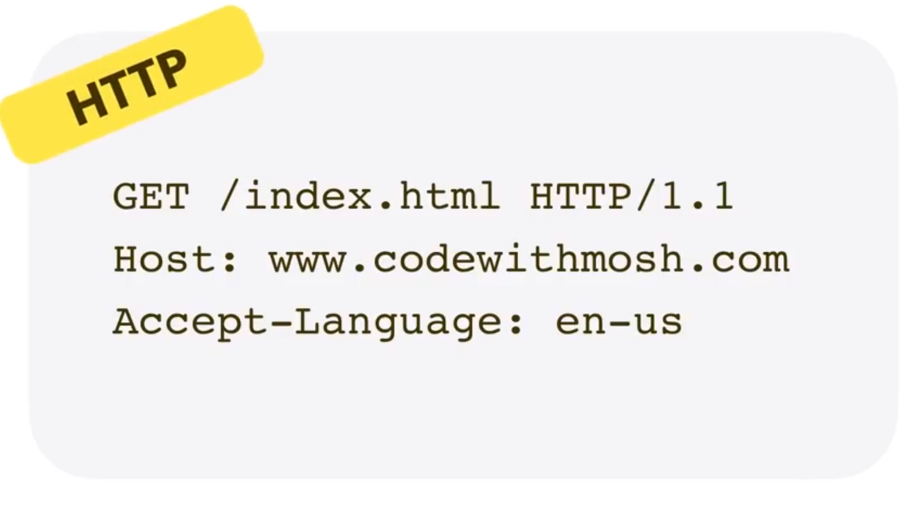
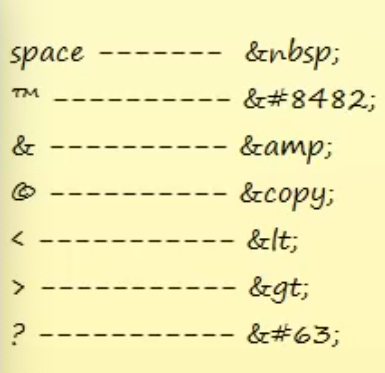
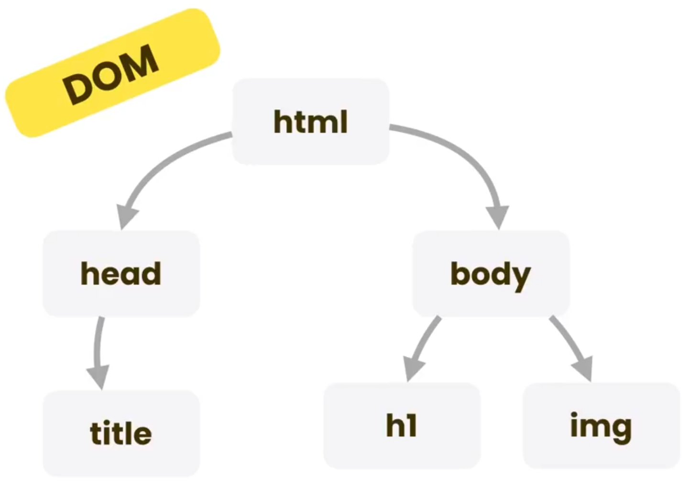
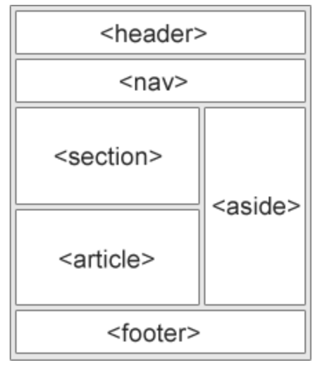
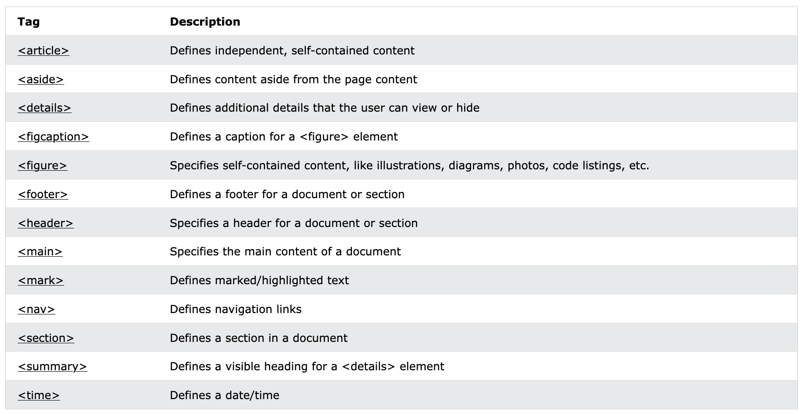
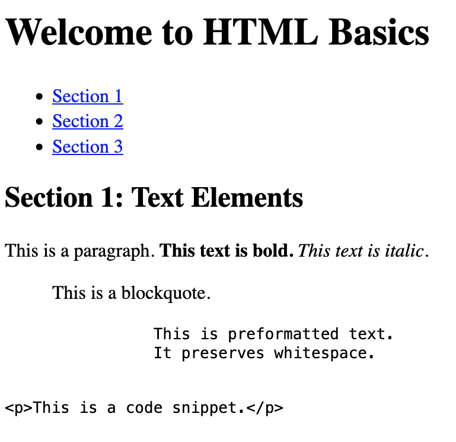
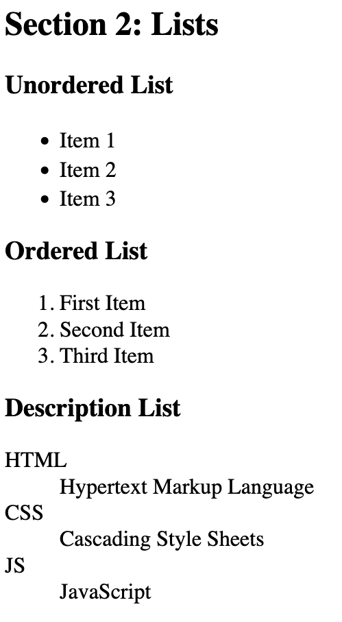
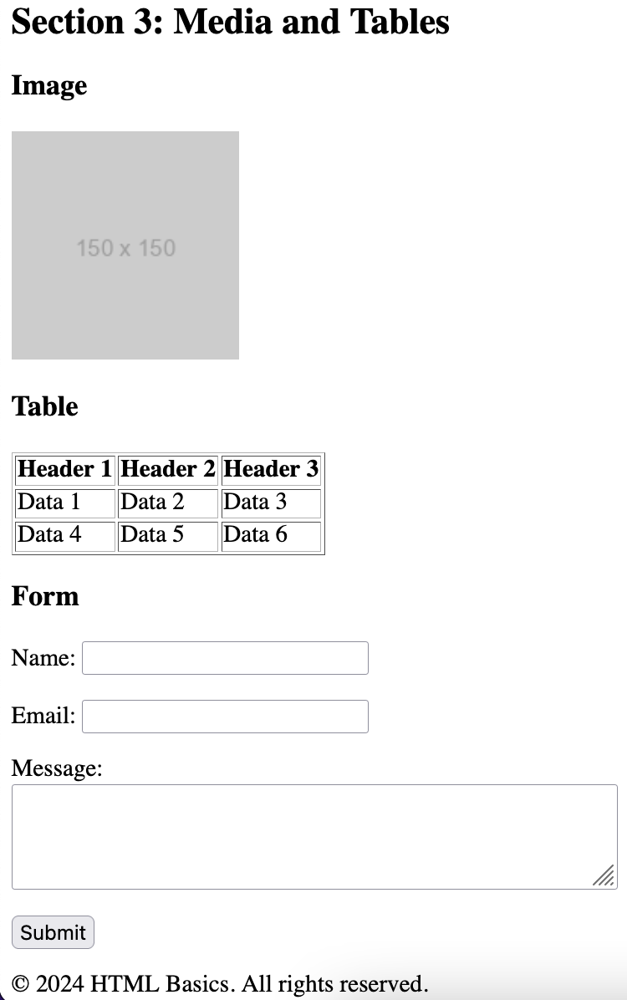
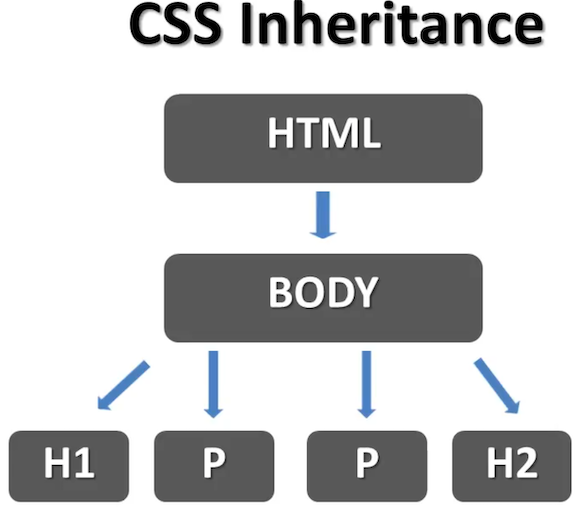

# Front-end-Class3

Front-end Crash course for Kadoos Private educational Institute. (HTML, CSS, and Bootstrap)

## Basics of the Web Applications

### Internet and Network Foundations

- Basics

  - Network History
  - All kinds of Applications
  - Web Applications
  - 

- Web Applications

  - Static
  - Dynamic

- Two Important aspects of Web Applications

  - Front-end
  - Back-end
  - Server and apps

- Front-end Basics

  - Blocks
  - Design
  - Functionalities

- Technologies

  - HTML (Hyper Text MarkUp Language)
  - CSS (Cascaded Style Sheet)
  - JavaScript

### HTML

- What is the HTML?

  - Browsers can Handel all things (inspect)
  - You can Work on A single text file
  - Talk about editors and IDEs
  - Browsers can paly a lot of different things like `HTML`, `SVG`, end etc.
  - Talk about postfix and extensions
  - The first version of HTML was written by `Tim Berners-Lee` in `1993`
  - What creates a Html file (open a notepad and save as file)
  - Talk about tags(Basics) angle brackets `<>`
  - A tag with its closing tag is a markup element
  - Four Important basic Tags `<!Doctype html>`, `<HTML>`, `<Head>`, and `<Body>`
  - Talk about Browser developer tools like `inspect`
  - Markup elements
  - Heading tags
  - Paragraph tag
  - Line Break tag (Empty element)
  - Line tag (self clos tag) is a empty element
  - Comment Tag `<!-- -->`
  - &nbsp mark for space

- Lists

  - Unordered lists `<ul>`
  - Ordered lists `<ol>`
  - List items `<li>`

- Tables

  - Table tag `<table>`
  - Row tag `<tr>`
  - Data tag `<td>`
  - Column tag `<th>`

- Links

  - Link to outside tag `<a href="www.google.com">`Google`</a>`
  - Define Attributes `href`
  - Link to inside tag `<a href="#Birds">` and `<a name=Birds>`

- Images

  - Image tag ``
  - Source attribute
  - Size Attributes
  - Use optimize size for your images
  - Alt Attributes

- Nested Elements

  - `<html>` is root elements
  - Child elements
  - Parent elements
  - Mismatch Elements

- HTML Forms

  - To collect data to do something
  - Implement a textbox element/ control (`type="text"`)
  - Attributes are belong to CSS and JavaScript courses
  - Change your textbox size (`size="50"`)
  - Implement a label element
  - `placeholder` attribute show a guid and default value inside your textbox or textarea elements
  - Add a Multi line textbox (textarea)
  - We can use just simple text as label
  - Implement a submit button (`type="submit"`)
  - Implement a Radio button (`type="radio"`)
  - Radio's name should be the same
  - Implement a CheckBox button (`type="checkbox"`)
  - Use `checked="checked"` for checked a box by default
  - Implement a Numbers field (`type="number"`)
  - For restrict user from entering random number we need JavaScript
  - Set `min=""` and `max=""` for your Numbers input
  - Implement a DropDownList using `select` tag
  - For Items we use `<option>` tag
  - Implement a date element `type="date"`
  - Use `<fieldset` tag to give a nice style to your page
  - `<legend>` tag add a nice title to your fieldset

- HTML Attributes

  - Differences between tags and elements
  - A specific attribute gives extra information about a particular element
  - Place attributes only in opening tag
  - Some attributes can be placed in every HTML elements tag, Like `class=""` attribute
  - On the other hand some attributes comes with a specific element, like `for=""` attribute

- Meta Tags
  - Is always put inside `<head>` elements
  - These elements give more information to search engines about your page
  - Meta tags is self-content tags and don't need close tag
  - Description Meta tag uses only 155 character
  - Keywords used for demonstrate the content of page to some search engin (Except Google)
  - Meta tags also give extra information about Author or language
- Special Characters

  - There is scape characters in HTML5
  - 

- Bold and Italic style

  - Use `<b>` tag to make a text bold
  - Use `<Strong>` tag to make a text bold
  - `<strong>` tag has special uses (ex: text speech programs) but ` <b>` tag is only for styling
  - Special features can be add to `<strong>` tag in `HTML6`
  - Use `<i>` tag to make a text italic
  - Use `<em>` tag to make a text bold
  - `<em>` tag has special uses (ex: text speech programs) but ` <i>` tag is only for styling

- Iframe Element

  - Use this element to embed content of another page to your page (for adverts, navigation, or images)

- Super & Sub Script

  - Its about topography and placing text and symbols at the top or bottom of other text

- Title and Alternative

  - In HTML5 we can use `title` attribute in every elements to show information about them when mouse hover over them
  - `alt` attribute show information about absence of an element

- Audio Tag

  - To place an audio in your page ypu can use `<audio>` tag
  - It support three different format file (`.mp3, .wav, and .ogg`)
  - It's important that you should place a `control` attribute for your audio element but you can choose arbitrary name for it
  - For placing different format of a file we can use `<source>` tag
  - By `autoplay` attribute you can play your file automatically
  - By `loop` attribute you can play your file in infinite loop
  - By `draggable="true"` attribute you can drag your player everywhere

- Video Tag

  - To place an audio in your page ypu can use `<video>` tag
  - It support two different format file (`.mp4 and .ogg`)
  - For placing different format of a file we can use `<source>` tag

- DOCTYPE

  - It's not a actual HTML tag
  - It shows the version of HTML that we use in our document

- Document Object Model (DOM)

  - It's a model that present HTML elements in our document
  - When a web page is loaded, the browser creates a Document Object Model of the page
  - The HTML DOM model is constructed as a tree of Objects
  - 
  - Use w3 validator to check your HTML codes
  - https://validator.w3.org/

- HTML Semantic Elements

  - A semantic element clearly describes its meaning to both the browser and the developer
  - A semantic Web allows data to be shared and reused across applications, enterprises, and communities
  - 
  - 

- Additional HTML Tags

  - Use `<pre>` tag for preformatted text
  - Use `<blockquote cite="">` tag for A section that is quoted from another source
  - Use `<code>` tag for code snippets
  - Use `<dl>` tag for present a description list (`<dt>`, `<dd>`)

- Exercise
  - Section1: 
  - Section2: 
  - Section3: 

 
 

### CSS

- What is the CSS?

  - CSS is `Cascading Style Sheet` for describing look and formatting documents written in a markup language
  - Adds style to your HTML
  - By CSS you can have control on your website look without changing your HTML
  - Talk about another HTML tag: `<style>`
  - select a tag in your HTML document ex:`h1 {  ...  }`
  - Each one of these style is a CSS `property`
  - Statement of changing in CSS : `Property : value`

- Changing font color, type, and size

  - Use `color`, `font-size`, and `font-family` property to change respectively color, size, and font type of your text
  - `px` stands for `pixel`
  - Selecting by `p` type change all paragraphs in our page

- Multi Selecting Tags

  - `h1, h2 {   ....  }`
  - By writing another selector you can change one of your multiple selected tags

- Border Property

  - `border-bottom`, `border-top` ...
  - Imply to the combine values

- CSS Inheritance and Overriding

  - What you get with hierarchy is inheritance
  - 
  -
  - Child inherit their properties from their parents
  - To change something individually you should change that in the child tag using overriding rule
  - By define a property for a child individually an override happens and it's `overriding`

- Using Classes

  - Create two paragraph with different classes (`blue`, `red`) and define classes in style tag
  - Definition class statement : `class="class_name"`
  - It don't need it to put class attribute closing tag and remember attribute always comes in opening tag
  - By removing tag name before dot notation it can be apply on all tags which have a specific class attribute
  - You can use multiple class name in your class attribute
  - Apply it by using `text-decoration` property

- Font Family

  - You can define which font apply on your text
  - If none of those fonts don't exist in the client computer system default font apply on your text
  - It's better to put font family property in your `body` tag

- Font Weight Property

  - Use `normal`, `bold`, `bolder`, and `lighter` for check this property
  - Some font families belongs to specific computers like `Mac`

- External Style Sheet

  - There is three way to apply stylesheet on HTML
  - `internal style sheet`, `external style sheet`, and `inline style sheet`
  - Internal stylesheet is good if you have only one page
  - It's more realistic to use external stylesheet
  - In a real world developing a website it is possible that you use all three way for styling
  - Create a separate file for your stylesheet `.css`
  - Transfer your code to your new file
  - Create a link tag in your head element
  - Define true address for your link

- Text Decoration

  - Talk about `text-decoration` property and `line-through`, `underline`, and `overline` values (`none`)
  - Talk about italic style by `font-style` and creating three different paragraph and classes
  - To make a word italic it's better to use HTML tags

- Web Colors

  - T
